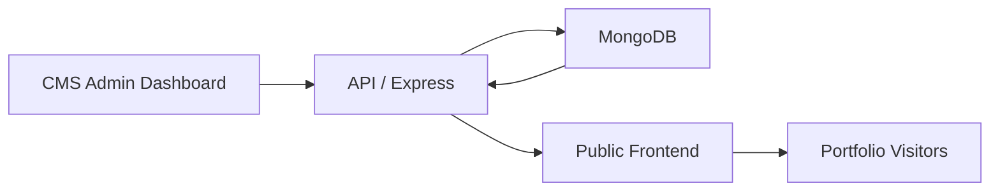

# Portfolio Website Ecosystem

A production portfolio workspace built around three separate apps:

- `frontend` for the public portfolio
- `cms` for the private content editor
- `api` for the Express and MongoDB backend

The backend is the source of truth. The CMS writes content to MongoDB through the API, and the public frontend reads the published portfolio from the API.

## Architecture



## Workspace Structure

```text
portfolio_ecosystem/
|-- api/
|-- cms/
|-- frontend/
|-- docs/
|-- README.md
```

## Apps

### Public Frontend

The visitor-facing portfolio site.

Highlights:

- responsive hero, about, skills, projects, journey, milestones, certificates, services, achievements, and contact sections
- dark and light theme support
- smooth scrolling and custom cursor
- motion and interaction polish with Framer Motion
- command palette
- SEO support with `react-helmet-async`
- content selectors and validation helpers so the UI can safely read CMS data

### CMS

The private admin dashboard for editing portfolio content.

Highlights:

- authenticated admin access
- editable modules for Home, About, Skills, Projects, Certificates, Journey, Milestones, Services, Achievements, Contact, Links, Settings, Account, Resume, and Inbox
- reusable form patterns for repeaters, structured entries, and icon selection
- validation, unsaved-change protection, confirmation dialogs, and toast feedback
- content synchronization with the API and MongoDB

### API

The backend service that stores and serves portfolio data.

Highlights:

- Express server with MongoDB and Mongoose
- JWT-based admin authentication
- public portfolio endpoint
- admin endpoints for portfolio modules, projects, certificates, account settings, and reset flows
- validation layers for module content
- seed scripts for admin and portfolio data

## Local Setup

Install dependencies separately in each app folder:

```bash
cd api
npm install

cd ../cms
npm install

cd ../frontend
npm install
```

Start the apps in this order:

```bash
cd api
npm run dev

cd ../cms
npm run dev

cd ../frontend
npm run dev
```

Default local ports:

- API: `http://localhost:4174`
- CMS: `http://localhost:5174`
- Frontend: `http://localhost:5173`

## Environment Variables

### API

Create `api/.env` with values like:

```env
PORT=4174
CLIENT_ORIGIN=http://localhost:5173
CMS_ORIGIN=http://localhost:5174
MONGODB_URI=mongodb://127.0.0.1:27017/portfolio_cms
JWT_SECRET=your-secret
JWT_EXPIRES_IN=8h
ADMIN_NAME=Harsh Kumar Singh
ADMIN_EMAIL=you@example.com
ADMIN_PASSWORD=your-password
```

### CMS

Create `cms/.env`:

```env
VITE_API_BASE_URL=http://localhost:4174
```

### Frontend

Create `frontend/.env`:

```env
VITE_API_BASE_URL=http://localhost:4174
```

## Useful Scripts

### API

```bash
npm run dev
npm run start
npm run lint
npm run seed:admin
npm run seed:portfolio
```

### CMS

```bash
npm run dev
npm run build
npm run lint
npm run preview
```

### Frontend

```bash
npm run dev
npm run build
npm run lint
npm run preview
```

## Documentation

- [API README](./api/README.md)
- [CMS README](./cms/README.md)
- [Frontend README](./frontend/README.md)

## Current Development Phase

Phase 1: CMS Foundation and Content Synchronization

Completed so far:

- separate public frontend, private CMS, and API structure
- MongoDB-backed content flow with the API as the source of truth
- authenticated CMS access
- reusable editor patterns, repeaters, validation, and icon catalog support
- content-driven sections for the public portfolio
- project and certificate management workflows
- portfolio settings, links, contact, journey, milestones, services, and achievements modules

Current focus:

- final content parity across all modules
- cleaner editor UX and layout consistency
- deployment hardening for Render and GitHub
- documentation and maintainability improvements
