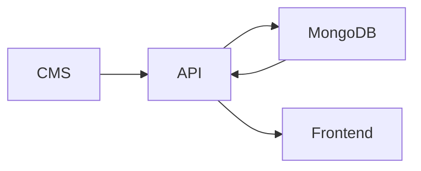

# Portfolio API

This is the backend for the portfolio ecosystem.

It connects the CMS and the public frontend to MongoDB, keeps the portfolio data in sync, and protects admin updates with authentication.

## What this API is responsible for

- saving and serving portfolio content
- handling admin login and session checks
- managing projects and certificates
- storing account updates
- providing the published portfolio data to the public frontend
- seeding the first admin user and default portfolio data

## How it fits in the ecosystem



The API is the source of truth for CMS-managed content. The CMS writes to it, MongoDB stores it, and the frontend reads the published version from it.

## Main routes

### Public routes

- `GET /api/health`
- `GET /api/portfolio`

### Auth routes

- `POST /api/auth/login`
- `GET /api/auth/session`
- `POST /api/auth/logout`

### Admin routes

- `GET /api/admin/me`
- `GET /api/admin/account`
- `PUT /api/admin/account`
- `PUT /api/admin/account/password`
- `GET /api/admin/portfolio`
- `POST /api/admin/portfolio/initialize`
- `PUT /api/admin/portfolio`
- `PUT /api/admin/portfolio/module/:module`
- `PUT /api/admin/portfolio/:field`
- `POST /api/admin/portfolio/reset`
- `GET /api/admin/portfolio-fields`
- `GET /api/admin/projects`
- `POST /api/admin/projects`
- `GET /api/admin/projects/:slug`
- `PUT /api/admin/projects/:slug`
- `DELETE /api/admin/projects/:slug`
- `GET /api/admin/certificates`
- `POST /api/admin/certificates`
- `GET /api/admin/certificates/:slug`
- `PUT /api/admin/certificates/:slug`
- `DELETE /api/admin/certificates/:slug`
- `GET /api/admin/media/config`
- `POST /api/admin/media/signature`
- `POST /api/admin/media`
- `DELETE /api/admin/media/:id`

## Data model overview

The API uses separate MongoDB models for:

- portfolio content
- portfolio modules
- projects
- certificates
- media assets
- contact messages
- admin users

This makes each content area easier to manage and update without mixing everything into one document.

## Local setup

Install dependencies:

```bash
npm install
```

Run the API in development:

```bash
npm run dev
```

Other scripts:

```bash
npm run start
npm run lint
npm run seed:admin
npm run seed:portfolio
```

## Environment variables

Create `api/.env`:

```env
PORT=4174
CLIENT_ORIGIN=http://localhost:5173
CMS_ORIGIN=http://localhost:5174
MONGODB_URI=mongodb://127.0.0.1:27017/portfolio_cms
JWT_SECRET=your-secret
JWT_EXPIRES_IN=8h
ADMIN_NAME=Harsh Kumar Singh
ADMIN_EMAIL=you@example.com
ADMIN_PASSWORD=your-password
CLOUDINARY_CLOUD_NAME=your-cloud-name
CLOUDINARY_API_KEY=your-api-key
CLOUDINARY_API_SECRET=your-api-secret
CLOUDINARY_FOLDER=portfolio-ecosystem
```

Cloudinary credentials belong only in the API environment. Never expose the API secret through a CMS or frontend `VITE_*` variable. The authenticated CMS requests short-lived upload signatures from the API and uploads images directly to Cloudinary.

## Current status

The backend foundation is already in place. The main work now is content completeness, editor improvements, and deployment setup.

## Future goal

Build the inbox page and connect it properly to the contact messages stored in the API.
