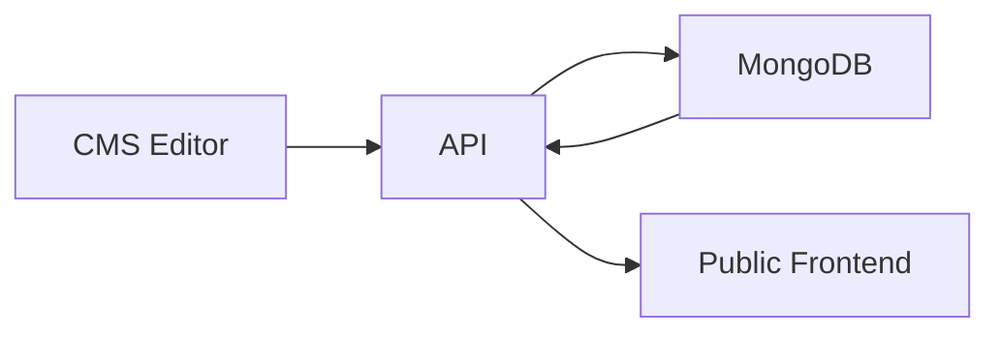

# Portfolio CMS

Private admin dashboard for managing the portfolio content that powers the public website.

## What this app does

- authenticates admin users
- edits portfolio modules through a shared content-editing system
- sends updates to the API, which persists them in MongoDB
- keeps the public frontend in sync with the latest published content

## Editable Areas

The CMS currently covers these areas:

- Dashboard
- Home
- About
- Skills
- Projects
- Certificates
- Journey
- Milestones
- Services
- Achievements
- Contact
- Links
- Settings
- Account
- Resume
- Inbox

## Key Editing Features

- reusable structured editors for lists and grouped data
- repeaters for adding, reordering, duplicating, and deleting items
- shared icon catalog and icon picker
- validation and safe defaults to protect the UI from bad data
- loading, saving, error, and success states
- unsaved-change warnings
- delete confirmations
- toast notifications

## Current Content Flow

The CMS does not store content locally as the main source of truth.
It loads and saves content through the API, and the API persists the data in MongoDB.



## Local Development

Install dependencies:

```bash
npm install
```

Run the dev server:

```bash
npm run dev
```

Other scripts:

```bash
npm run build
npm run lint
npm run preview
```

## Environment

Create `cms/.env`:

```env
VITE_API_BASE_URL=http://localhost:4174
```

## Notes

- This app is private and should not expose admin access points on the public portfolio.
- Form layouts, reusable controls, and content modules are designed to stay consistent with the public frontend.
