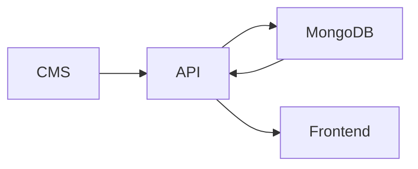

# Portfolio CMS

This is the private dashboard for managing the portfolio.

It is used to edit content, update projects and certificates, manage links and settings, and keep the public frontend in sync with MongoDB data.

## What this CMS is responsible for

- admin login and private access
- editing portfolio content through forms
- managing repeatable lists and structured data
- picking icons from the shared icon catalog
- validating data before saving
- showing save states, errors, and confirmations
- sending updates to the API

## Editable areas

The CMS currently covers:

- Dashboard
- Home
- About
- Skills
- Projects
- Certificates
- Journey
- Milestones
- Services
- Achievements
- Contact
- Links
- Settings
- Account
- Resume
- Inbox

## How it fits in the ecosystem



The CMS does not keep content as the main source of truth. It sends changes to the API, and the API stores them in MongoDB.

## Key editor features

- reusable form fields
- repeater controls for lists
- icon picker with a shared icon catalog
- unsaved changes warning
- delete confirmation
- toast feedback
- validation and safe defaults
- loading and saving states

## Local setup

Install dependencies:

```bash
npm install
```

Run the CMS in development:

```bash
npm run dev
```

Other scripts:

```bash
npm run build
npm run lint
npm run preview
```

## Environment variables

Create `cms/.env`:

```env
VITE_API_BASE_URL=http://localhost:4174
```

## Current status

Most of the CMS foundation is already built. The focus now is on polishing the editor experience, keeping the layout consistent, and finishing the remaining module work.

## Future goal

Build the inbox page so contact messages can be reviewed and managed from the dashboard.
