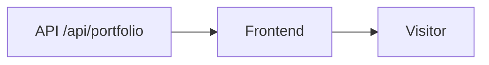

# Portfolio Frontend

This is the public portfolio website that visitors see.

It shows the live portfolio content, keeps the design polished, and reads published data from the API instead of depending on hardcoded page content.

## What this frontend is responsible for

- showing the public portfolio
- loading published content from the API
- rendering the main sections of the site
- keeping the UI responsive and smooth
- supporting dark and light themes
- handling animations and interaction details

## Main sections

- Hero
- About
- Skills
- Projects
- Journey
- Milestones
- Certificates
- Services
- Achievements
- Contact

## How it fits in the ecosystem



The frontend asks the API for the latest published portfolio data. If the API is unavailable, it uses the repository snapshot assembled in `src/content/portfolioFallback.js`.

## Source structure

```text
src/
├── app/         # App shell, providers, routes, and route metadata
├── components/  # Reusable common, layout, and section components
├── config/      # Navigation, command, and icon mappings
├── content/     # Modular offline portfolio content and content helpers
├── hooks/       # Reusable React hooks
├── motion/      # Shared animation variants
├── pages/       # Route-level screens
├── services/    # API and Cloudinary integration
├── state/       # React contexts and providers
├── styles/      # Global, layout, common, section, page, and responsive CSS
└── utils/       # Framework-independent helpers
```

Static home-page SEO is managed in `index.html`. Route-specific titles and descriptions are updated by `src/app/SiteMetadata.jsx`.

## Main features

- dark and light theme toggle
- smooth scrolling
- custom cursor
- command palette
- animated sections with Framer Motion
- static crawler-readable SEO and social metadata
- content selectors, defaults, and validation helpers

## Local setup

Install dependencies:

```bash
npm install
```

Run the frontend in development:

```bash
npm run dev
```

Other scripts:

```bash
npm run build
npm run lint
npm run format
npm run format:check
npm run preview
```

## Environment variables

Create `frontend/.env`:

```env
VITE_API_BASE_URL=http://localhost:4174
```

## API dependency

The frontend reads the published portfolio from:

```text
GET /api/portfolio
```

Make sure the API is running before opening the public site.

## Current status

The public experience is already connected to the CMS-driven content flow. The remaining work is mostly about refinement and keeping the data model clean.
